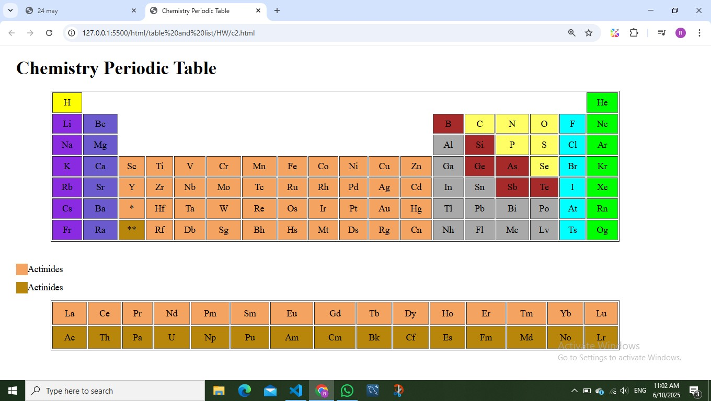

# 🧪 Chemistry Periodic Table

A clean and visually structured **Periodic Table of Elements** built using HTML and CSS.  
This project displays all chemical elements in their correct positions with color-coded categories for better understanding.

## 📸 Preview

## 🚀 Features

- ✅ Complete periodic table layout  
- 🎨 Color-coded element groups  
- 📐 Proper table alignment  
- 💻 Pure HTML & CSS implementation  
- 📱 Beginner-friendly structure  
- ⚡ Lightweight and fast  

## 🛠️ Technologies Used

- HTML5  
- CSS3  

